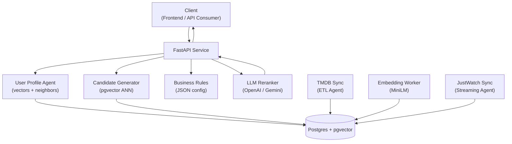
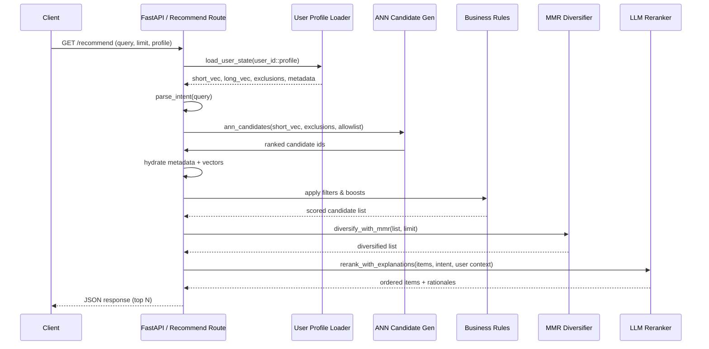

# 🎬 Seen’emAll

AI-powered movie & TV recommender that learns your taste from what you’ve already seen.
Built with **FastAPI**, **Postgres + pgvector**, and **sentence-transformers**.

---

## ⚙️ Stack
- **FastAPI** backend
- **Postgres** (with `pgvector` extension)
- **sentence-transformers MiniLM-L6-v2** for embeddings (configurable)
- **TMDB API** for metadata ingestion
- **Docker Compose** for one-command setup
- Collaborative neighbor blend powered by pgvector
- Optional LLM reranking (OpenAI / Gemini compatible)

---

## 🏗️ High-Level Architecture



---

## 🔄 Request Lifecycle



---

## 🚀 Quick Start

```bash
# 1. Unpack & enter
unzip SeenemAll.zip -d .
cd SeenemAll

# 2. Configure
cp .env.example .env
# edit TMDB_API_KEY=your_tmdb_key
# optional: set RERANK_PROVIDER (openai | gemini | small) + RERANK_API_KEY when needed
# optional: tweak USER_PROFILE_DECAY_HALF_LIFE, EMBED_MODEL/EMBED_BATCH, EMBED_VERSION/TEMPLATE

# 3. Launch stack
docker compose up -d --build
# (rerun with --build after frontend changes to refresh the static bundle)

# 4. Run migrations
make migrate

# 5. Populate catalog
make etl-tmdb

# 6. Generate embeddings
make embed

# 7. Sync streaming availability (optional)
make etl-justwatch

# 8. Create sample user history (profiles + explicit event types supported)
curl -X POST http://localhost:8000/user/history \
  -H "content-type: application/json" \
  -d '{"user_id":"u1","profile":"main","items":[1,2,3,4,5],"event_type":"watched"}'

# 9. Record negative feedback (optional)
curl -X POST http://localhost:8000/user/history \
  -H "content-type: application/json" \
  -d '{"user_id":"u1","profile":"kids","items":[42],"event_type":"not_interested"}'

# 10. Get recommendations (profile-aware)
curl "http://localhost:8000/recommend?user_id=u1&profile=main&limit=10"

# 11. Continue with cursor pagination (optional)
# Response payload includes {"items": [...], "next_cursor": "..."}
curl "http://localhost:8000/recommend?user_id=u1&profile=main&limit=10&cursor=eyJyYW5rIjoxMH0"
````

---

## 🔁 LLM Reranker

- Hosted options:
  - `RERANK_PROVIDER=openai` with `RERANK_API_KEY` (or `OPENAI_API_KEY` fallback).
  - `RERANK_PROVIDER=gemini` with a compatible Google Generative AI key.
  - Defaults: `RERANK_MODEL=gpt-4o-mini` (OpenAI) and `gemini-2.0-flash-exp` (Gemini).
- Lightweight option: `RERANK_PROVIDER=small` activates the new MiniLM-L6-v2 reranker
  that runs locally, caps the input window at 40 items, and returns the best 12 without
  calling an external API. No API key is required; it reuses the embedding pipeline.
- Small-model knobs (all optional, see `.env.example` for defaults):
  `SMALL_RERANK_INPUT_WINDOW`, `SMALL_RERANK_OUTPUT_LIMIT`,
  `SMALL_RERANK_TIMEOUT`, `SMALL_RERANK_CACHE_TTL`, `SMALL_RERANK_CACHE_MAXSIZE`,
  and `SMALL_RERANK_RANK_WEIGHT` (bias toward original ANN order).
- To drop unrated catalog rows entirely, set `HEURISTIC_MIN_SIGNAL_MULTIPLIER`
  (>0). Leaving it at `0` (default) keeps the old behavior but still logs the
  signal multiplier for debugging.
- Disable any provider with `RERANK_ENABLED=0`; when disabled or misconfigured, we fall
  back to ANN ordering plus heuristic explanations automatically.

---

## 🧠 Recommendation Pipeline Details

The `/recommend` route orchestrates several retrieval streams before reranking:

- **Entity linker** – `api/core/entity_linker.py` resolves people and titles via TMDB.
  The singleton linker is created during `FastAPI` lifespan startup (`api/main.py`) and
  attached to `app.state.entity_linker`, so every request shares the same cache and
  client. Intent parsing receives the resolved IDs so prompts and downstream filters
  can respect explicit “more like *Interstellar*” style queries.

- **Hybrid query rewrite** – when a short-term embedding exists, we blend it with the
  rewrite vector returned by `rewrite_query(...)`. The mix is controlled by
  `_REWRITE_BLEND_ALPHA` (default `0.5`) and produces a normalized vector that goes into
  `ann_candidates(...)`. Cold-start users skip the blend entirely and fall back to
  `_cold_start_candidates(...)`, which prefers popularity/trending ranks for the given
  intent filters. If the user has no history but a natural-language query is present,
  we still run ANN retrieval directly on the rewrite vector so “like Squid Game” style
  prompts can pull in semantically similar titles even before the profile warms up.
  When `INTENT_ENABLE_ANN_DESCRIPTION=1`, the rewrite vector blends the short
  `ann_description` sentence with the structured rewrite; tune the contribution via
  `ANN_DESCRIPTION_WEIGHT` (default `0.6`). For local tuning, you can also pass
  per-request overrides such as `use_llm_intent=false`,
  `ann_description_override=...`, `rewrite_override=...`, and the weight knobs
  `ann_weight_override` / `rewrite_weight_override`. Likewise, mixer weights can be
  overridden with `mixer_ann_weight`, `mixer_collab_weight`,
  `mixer_trending_weight`, `mixer_popularity_weight`, and `mixer_novelty_weight`
  (the React UI exposes sliders for all of these debug controls).

- **Collaborative recall** – neighbor metadata captured in `users.neighbors` (see
  `api/core/user_profile.py`) identifies similar users and the items they recently liked.
  `_collaborative_candidates(...)` scores those titles and injects them alongside ANN
  results while respecting exclusions and allow-lists.

- **Trending prior** – `_trending_prior_candidates(...)` pulls from `Item.popularity`,
  `popular_rank`, and `trending_rank`. The helper protects tests and stubs by gracefully
  handling rows that lack full columns; when running without a real database (as in the
  unit suite), it simply returns an empty list.

- **Mixer scoring** – `_apply_mixer_scores(...)` combines ANN relevance, collaborative
  similarity, trending boosts, and a novelty bonus. The weights can be tuned via
  environment variables:
  - `MIXER_COLLAB_WEIGHT` (default `0.3`)
  - `MIXER_TRENDING_WEIGHT` (default `0.2`)
  - `MIXER_NOVELTY_WEIGHT` (default `0.1`)
  - ANN keeps the existing `_HYBRID_ANN_WEIGHT` with a minimum floor.

These sources all feed into business rules, optional MMR diversification, and the LLM
reranker (when enabled), producing the final explanations and ordering.

---

## 🧱 Business Rules & Caching

- Tweak ranking behaviour via `config/business_rules.json` (or point `BUSINESS_RULES_PATH`
  to an environment-specific file). Filters/boosts reload automatically when the file changes.
- Recommendation responses are cached in-memory per `(user, profile, query, limit, diversify)`
  with optional TTL (override via `RECOMMEND_CACHE_TTL_SECONDS`, default 300s). The cache
  is invalidated after `/user/history` updates so profile changes take effect immediately.
- `GET /recommend` now returns `{"items": [...], "next_cursor": "..."}`; pass the returned
  cursor back in `cursor=` to fetch the next page without recomputing the ranking pipeline.

---

## 🌍 Streaming Availability

- Configure `JUSTWATCH_COUNTRY` (default `IL`) to control the locale for offers.
- Optional: tweak `JUSTWATCH_LANGUAGE` (default `en`) and `JUSTWATCH_PLATFORM` (default `WEB`) for different JustWatch markets.
- Run `make etl-justwatch` to populate the `availability` table with per-service links.
- Data is refreshed by replacing rows per item/country, keeping the table idempotent.

---

## 👤 Profiles & Feedback

- `profile` is optional on `/user/history` and `/recommend`; if supplied we store vectors under `user_id::profile`.
- Supported event types: `watched` (default), `liked`, `rated`, plus negative signals `not_interested` / `disliked`.
- Negative items are excluded from vector updates and automatically filtered from recommendation candidates.
- Tune long/short recency with `USER_PROFILE_DECAY_HALF_LIFE` (default `10` recent items).
- Reranker context now includes genre preferences, collaborative neighbor diagnostics, and negative item IDs for richer explanations.

---

## 🔗 Watch Links

- Get a redirect to a streaming service with `/watch-link/{item_id}`.
- Query params: `service` (e.g., `nfx`), `country` (e.g., `US`).
- Example:
  ```bash
  curl "http://localhost:8000/watch-link/335984?service=nfx&country=US"
  ```

---

## ❤️ Feedback

- Send recommendation feedback (impressions, clicks) to the `/feedback` endpoint.
- Example:
  ```bash
  curl -X POST http://localhost:8000/feedback \
    -H "content-type: application/json" \
    -d '{"user_id":"u1","item_id":335984,"event_type":"click","meta":{"rank":5}}'
  ```

---

## 🧠 Agents

See [AGENTS.md](./AGENTS.md) for roles and flow.

---

## ✅ Progress

See [TASKS.md](./TASKS.md) for the up-to-date roadmap.

---

## ⚖️ Attribution

> This product uses the TMDB API but is not endorsed or certified by TMDB.
> Data provided by [The Movie Database (TMDB)](https://www.themoviedb.org).

---

## 📄 License

MIT © Natan Ayalo
