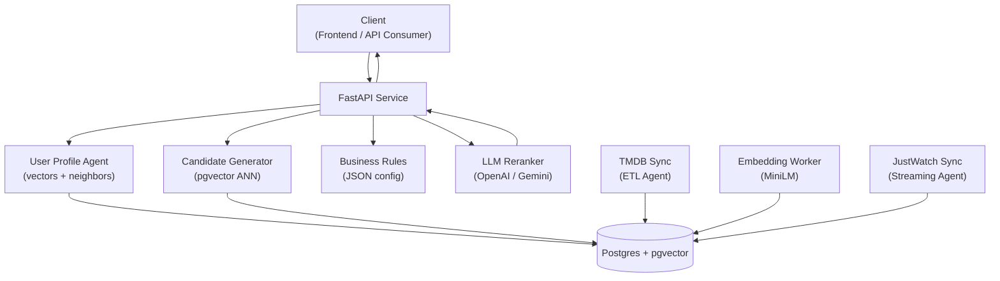
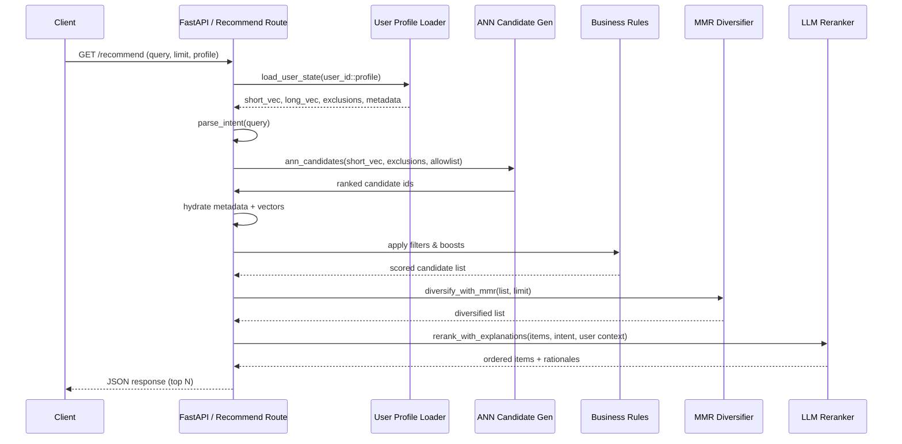

# 🎬 Seen’emAll

AI-powered movie & TV recommender that learns your taste from what you’ve already seen.
Built with **FastAPI**, **Postgres + pgvector**, and **sentence-transformers**.

---

## ⚙️ Stack
- **FastAPI** backend
- **Postgres** (with `pgvector` extension)
- **sentence-transformers MiniLM-L6-v2** for embeddings (configurable)
- **TMDB API** for metadata ingestion
- **Docker Compose** for one-command setup
- Collaborative neighbor blend powered by pgvector
- Optional LLM reranking (OpenAI / Gemini compatible)

---

## 🏗️ High-Level Architecture



---

## 🔄 Request Lifecycle



---

## 🚀 Quick Start

```bash
# 1. Unpack & enter
unzip SeenemAll.zip -d .
cd SeenemAll

# 2. Configure
cp .env.example .env
# edit TMDB_API_KEY=your_tmdb_key
# optional: set RERANK_PROVIDER/RERANK_API_KEY for LLM reranking
# optional: tweak USER_PROFILE_DECAY_HALF_LIFE, EMBED_MODEL/EMBED_BATCH, EMBED_VERSION/TEMPLATE

# 3. Launch stack
docker compose up -d --build
# (rerun with --build after frontend changes to refresh the static bundle)

# 4. Run migrations
make migrate

# 5. Populate catalog
make etl-tmdb

# 6. Generate embeddings
make embed

# 7. Sync streaming availability (optional)
make etl-justwatch

# 8. Create sample user history (profiles + explicit event types supported)
curl -X POST http://localhost:8000/user/history \
  -H "content-type: application/json" \
  -d '{"user_id":"u1","profile":"main","items":[1,2,3,4,5],"event_type":"watched"}'

# 9. Record negative feedback (optional)
curl -X POST http://localhost:8000/user/history \
  -H "content-type: application/json" \
  -d '{"user_id":"u1","profile":"kids","items":[42],"event_type":"not_interested"}'

# 10. Get recommendations (profile-aware)
curl "http://localhost:8000/recommend?user_id=u1&profile=main&limit=10"

# 11. Continue with cursor pagination (optional)
# Response payload includes {"items": [...], "next_cursor": "..."}
curl "http://localhost:8000/recommend?user_id=u1&profile=main&limit=10&cursor=eyJyYW5rIjoxMH0"
````

---

## 🔁 LLM Reranker

- Set `RERANK_PROVIDER=openai` with `RERANK_API_KEY` (or rely on `OPENAI_API_KEY`) **or**
  `RERANK_PROVIDER=gemini` with a compatible Google Generative AI key.
- Defaults: `RERANK_MODEL=gpt-4o-mini` for OpenAI, `gemini-2.0-flash-exp` for Gemini.
- Disable temporarily with `RERANK_ENABLED=0`; without a key we automatically fall back
  to ANN ordering with heuristic explanations.

---

## 🧱 Business Rules & Caching

- Tweak ranking behaviour via `config/business_rules.json` (or point `BUSINESS_RULES_PATH`
  to an environment-specific file). Filters/boosts reload automatically when the file changes.
- Recommendation responses are cached in-memory per `(user, profile, query, limit, diversify)`
  with optional TTL (override via `RECOMMEND_CACHE_TTL_SECONDS`, default 300s). The cache
  is invalidated after `/user/history` updates so profile changes take effect immediately.
- `GET /recommend` now returns `{"items": [...], "next_cursor": "..."}`; pass the returned
  cursor back in `cursor=` to fetch the next page without recomputing the ranking pipeline.

---

## 🌍 Streaming Availability

- Configure `JUSTWATCH_COUNTRY` (default `IL`) to control the locale for offers.
- Optional: tweak `JUSTWATCH_LANGUAGE` (default `en`) and `JUSTWATCH_PLATFORM` (default `WEB`) for different JustWatch markets.
- Run `make etl-justwatch` to populate the `availability` table with per-service links.
- Data is refreshed by replacing rows per item/country, keeping the table idempotent.

---

## 👤 Profiles & Feedback

- `profile` is optional on `/user/history` and `/recommend`; if supplied we store vectors under `user_id::profile`.
- Supported event types: `watched` (default), `liked`, `rated`, plus negative signals `not_interested` / `disliked`.
- Negative items are excluded from vector updates and automatically filtered from recommendation candidates.
- Tune long/short recency with `USER_PROFILE_DECAY_HALF_LIFE` (default `10` recent items).
- Reranker context now includes genre preferences, collaborative neighbor diagnostics, and negative item IDs for richer explanations.

---

## 🔗 Watch Links

- Get a redirect to a streaming service with `/watch-link/{item_id}`.
- Query params: `service` (e.g., `nfx`), `country` (e.g., `US`).
- Example:
  ```bash
  curl "http://localhost:8000/watch-link/335984?service=nfx&country=US"
  ```

---

## ❤️ Feedback

- Send recommendation feedback (impressions, clicks) to the `/feedback` endpoint.
- Example:
  ```bash
  curl -X POST http://localhost:8000/feedback \
    -H "content-type: application/json" \
    -d '{"user_id":"u1","item_id":335984,"event_type":"click","meta":{"rank":5}}'
  ```

---

## 🧠 Agents

See [AGENTS.md](./AGENTS.md) for roles and flow.

---

## ✅ Progress

See [TASKS.md](./TASKS.md) for the up-to-date roadmap.

---

## ⚖️ Attribution

> This product uses the TMDB API but is not endorsed or certified by TMDB.
> Data provided by [The Movie Database (TMDB)](https://www.themoviedb.org).

---

## 📄 License

MIT © Natan Ayalo
